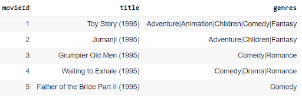
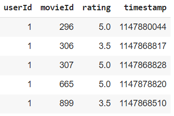
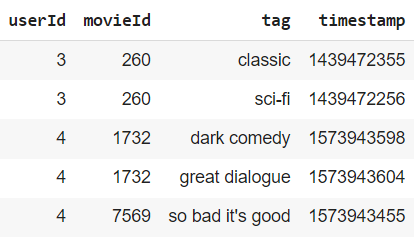

# Sistema de Recomendação de Filmes
## Projeto interdisciplinar do 2º semestre do curso de Especialização em Ciência de Dados - 2023

- Juliana Luz Passos Argenton
- Marlon xx
- Washington xx

## Resumo
Dada a disponibilidade de um número quase ilimitado de opções de filmes, sistemas de recomendação desempenham papel importante na personalização da experiência do usuário em vários tipos de plataformas e serviços online, oferecendo a ele orientação para o próximo item que atenda às suas expectativas.
O objetivo deste trabalho é apresentar um modelo de machine learning para recomendação de filmes.
O banco de dados analisado foi disponibilizado pelo site MovieLens e contém 25 milhões de avaliações de 62 mil filmes realizadas por 162 mil usuários. As avaliações foram realizadas em escala de 0,5 a 5, sendo que quanto maior a nota melhor a avaliação.
Após testar três modelos de filtragem colaborativa, o algoritmo SVD foi escolhido com RMSE = 0,96.

## Introdução
Segundo a Wikipedia, o primeiro sistema de recomendação foi criado em 1979, pela cientista da computação Elaine Rich, para recomendar livros. Sua ideia era criar um sistema que fizesse perguntas específicas ao usuário e atribuísse suas características com base nas suas respostas. Dependendo do estereótipo do usuário, ele receberia uma recomendação de um livro do qual poderia gostar. 

### Tipos de sistemas
Atualmente existem muitas maneiras e algoritmos usados ​​para construir um sistema de recomendação. As principais abordagens são: Item Mais Popular, Associação/Modelo de Cesta, Filtragem de Conteúdo, Filtragem Colaborativa (baseado no usuário e/ou no item) e Modelos Híbridos.
Intuitivamente, os Modelos Híbridos parecem ser mais efetivos, já que combinam duas ou mais estratégias de recomendação, porém, neste trabalho, vamos assumir que usuários semelhantes avaliam de forma semelhante os filmes e usar os métodos de filtragem colaborativa, mais especificamente o SVD e NMF, considerando a abordagem baseada nos itens (filmes).
**User-based vs Item-Based**
Lembrando que a abordagem deste trabalho supõe que usuários semelhantes exibem preferências semelhantes. Para determinar o grupo de referência no modelo **user-based**, leva-se em consideração que tanto o usuário quanto o grupo compartilham um histórico de classificação de itens semelhantes. Na próxima etapa, o sistema aloca os únicos itens aos quais o grupo de referência foi exposto anteriormente e recomenda os itens do usuário final com base na classificação dos usuários do grupo que avaliaram aquele item. As técnicas colaborativas **item-based** analisam a matriz item-usuário e identificam relações entre diferentes itens. O sistema de recomendação baseado em itens faz, então, recomendações com base nas relações lineares (semelhanças) entre os itens.

Este trabalho avalia a Filtragem Colaborativa Baseada em Itens. No contexto de uma recomendação de filme para filme, um filtro colaborativo responde à pergunta: “Quais filmes têm um perfil de avaliação de usuário semelhante?”.

## Objetivo
O objetivo deste trabalho é apresentar um modelo de machine learning para recomendação de filmes a partir da metodologia de recomendação baseada em item.

## Biblioteca Surprise
A biblioteca Surprise, segundo os próprios autores, é um pacote Python para construir e analisar sistemas de recomendação que lidam com dados de classificação explícitos.
A biblioteca tem uma documentação bem completa, com a proposta de dar autonomia ao desenvolvedor. O pacote Surprise já disponibiliza diversos algoritmos prontos para previsão. Além disso, possui ferramentas para avaliar os modelos.

## Metodologia
Foi realizada análise exploratória de dados através do cálculo de medidas resumo e construção de gráficos.
Três algoritmos de machine learning foram testados para avaliar a acurácia da predição das avaliações: Centered KNN, SVD e NMF.
Os dados foram divididos em treinamento (80%) e teste. Foi realizado refinamento de parâmetros no modelo com melhor desempenho inicial e validação cruzada no modelo final.

**Centered KNN**
O KNN é um algoritmo baseado em memória, ou seja, é usado todo o banco de dados para calcular as predições. Na biblioteca surprise, o Centered KNN é nomeado como KNNWithMeans e aceita 3 hiperparâmetros k (máximo número de vizinhos), min_k (número mínimo de vizinhos) e sim_options (dicionário de opções sobre as medidas de similaridade. Esse algoritmo leva em consideração a nota média de cada usuário.

**SVD**
SVD (Singular Value Decomposition) é um algoritmo de fatoração de matrizes, cujo objetivo é reduzir a dimensionalidade para diminuir o custo computacional, já que se beneficia das propriedades da álgebra linear. Em resumo, a fatoração de matrizes pode ser vista como a decomposição de uma matriz grande em um produto de matrizes menores. Isso é semelhante à fatoração de números inteiros, onde 12 pode ser escrito como 6x2 ou 4x3, por exemplo. No caso de matrizes, uma matriz A com dimensões mxn pode ser reduzida a um produto de duas matrizes X e Y com dimensões mxp e pxn respectivamente.
O SVD decompõe qualquer matriz em vetores singulares e valores singulares. O objetivo geral do SVD é decompor a matriz R com todos os elementos faltantes e, posteriormente, multiplicar seus componentes. Como resultado, não há valores ausentes e é possível recomendar a cada usuário filmes (itens) que ainda não viram.
Na biblioteca surprise, o SVD é nomeado como SVD e aceita 16 hiperparâmetros, entre eles o número de fatores (n_factors), o número de iterações (n_epochs), alguns parâmetros de aprendizagem e de regularização.

**NMF**
NMF (Non-negative Matrix Factorization) também é um algoritmo de fatoração de matrizes. O NMF decompõe a matriz não negativa em duas outras matrizes, em que as colunas da primeira representam os componentes e a segunda matriz armazena os pesos. O NMF coloca restrições para que as duas matrizes formadas sejam não negativas. Essa restrição é a principal diferença em relação ao SVD.
Na biblioteca surprise, o NMF é nomeado como NMF e aceita 12 hiperparâmetros, entre eles o número de fatores (n_factors), o número de iterações (n_epochs), alguns parâmetros de aprendizagem e de regularização.

**Acurácia**
A medida de acurácia escolhida nesta análise é o RMSE, que calcula a raiz da média dos erros quadráticos, ou seja, para cada observação, é calculada a diferença entre o valor real e o predito e essa diferença é elevada ao quadrado. Então é obtida a média de todas as diferenças e por fim é extraída a raiz quadrada. Com isso, é intuitivo, que o RMSE aumenta a penalização de diferenças maiores. Para a interpretação, devemos considerar que as notas de avaliação variam entre 0,5 e 5, portanto, um RMSE de 1 corresponde a 22% da escala e já parece ser razoavelmente alto.

## Dados
MovieLens é um site de recomendação de filmes, administrado pela GroupLens Research da Universidade de Minnesota, que usa tecnologia de filtragem colaborativa para fazer recomendações de filmes. A GroupLens Research coletou e disponibilizou conjuntos de dados de classificação do site MovieLens (https://movielens.org), para pesquisadores que apresentem interesse em evoluir no aprendizado de personalização e tecnologias de filtragem.
No site https://grouplens.org/datasets/movielens/ há vários conjuntos de dados disponibilizados, escolhemos estudar o conjunto que contém 25 milhões de avaliações, que foram feitas em 62 mil filmes por 162 mil usuários. Os dados foram gerados entre janeiro de 1995 e novembro de 2019.
Os usuários foram selecionados aleatoriamente para inclusão. Todos os usuários selecionados avaliaram pelo menos 20 filmes. Não há informações demográficas disponíveis. Cada usuário é representado por um ID e nenhuma outra informação do usuário é fornecida.
Os dados estão divididos em alguns arquivos e neste trabalho foram usados os seguintes arquivos:
- movies.csv: ID do filme, título do filme e gênero do filme (aventura, animação, criança etc) - usado na análise descritiva;

- ratings.csv: ID do usuário, ID do filme, nota dada pelo usuário ao filme e data da avaliação - usado nos modelos de machine learning. O usuário avalia o filme com uma nota entre 0.5 e 5, sendo que quanto maior a nota, mais ele gostou do filme;

- tags.csv: ID do usuário, ID do filme, tag dada pelo usuário ao filme (clássico, ficção científica, comédia etc) e data da avaliação - usado na análise descritiva.

## Arquitetura e Infraestrutura
Xxx

## Resultados
Comentar um pouco sobre os achados na AED.
Entre os modelos testados, a melhor acurácia no banco de treinamento foi do NMF (RMSE=0,11), seguida no KNN (RMSE=0,50) e do SVD (RMSE=0,68). O modelo NMF foi escolhido para o refinamento de parâmetros e, ao avaliar o RMSE no banco de teste, foi observado que no banco de treinamento houve overfitting, já que o RMSE no banco de teste foi 10 vezes maior (1,12). Dado esse resultado, foi aplicado o refinamento de parâmetros usando o algoritmo SVD, que apresentou bom comportamento na validação cruzada com RMSE médio de 0,96 e desvio padrão de 0,003.
Não foi aplicado o refinamento de parâmetros no KNN, pois não temos recursos computacionais o suficiente para rodar. Porém, avaliando a acurácia com validação cruzada, sem refinamento de parâmetros, foi observado RMSE médio de 1,04 com desvio padrão de 0,004.

## Conclusão
No banco de dados avaliado, o melhor algoritmo para sugerir filmes ao usuário é o SVD.

## Trabalhos Futuros
Avaliar se existe oportunidade de melhorar a performance da recomendação testando outros algoritmos, até mesmo usando modelos híbridos a partir de deep learning.
